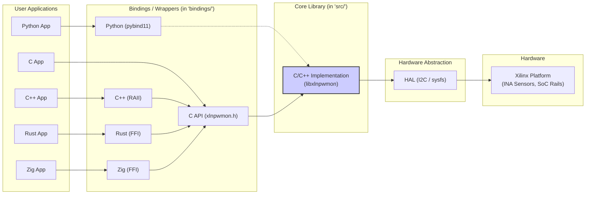

# Contributing to xilinx-power-monitor

First off, thank you for considering contributing to xilinx-power-monitor! We welcome contributions from everyone, whether it's reporting a bug, submitting a feature request, improving documentation, or writing code.

This document provides guidelines and information to help you contribute effectively.

## Table of Contents

- [Code of Conduct](#code-of-conduct)
- [Getting Started](#getting-started)
  - [Architecture Overview](#architecture-overview)
  - [Implementation Details](#implementation-details)
- [Development Setup](#development-setup)
  - [Prerequisites](#prerequisites)
  - [Building from Source](#building-from-source)
- [Development Guidelines](#development-guidelines)
  - [Code Style](#code-style)
  - [Testing](#testing)
  - [Documentation](#documentation)
  - [Commit Messages](#commit-messages)
- [Submitting Contributions](#submitting-contributions)
  - [Reporting Bugs](#reporting-bugs)
  - [Suggesting Enhancements](#suggesting-enhancements)
  - [Pull Request Process](#pull-request-process)
  - [Review Process](#review-process)
- [Common Development Tasks](#common-development-tasks)
- [Release Process](#release-process)
- [Reporting Security Issues](#reporting-security-issues)
- [License](#license)

## Code of Conduct

This project adheres to the Contributor Covenant Code of Conduct. By participating, you are expected to uphold this code. Please report unacceptable behavior to [Project Maintainer Email or Contact Method]. ([Link to CODE_OF_CONDUCT.md if you have one])

## Getting Started

### Architecture Overview

The `xilinx-power-monitor` library aims to provide a consistent interface for reading power metrics across different Xilinx platforms.

**Core Components:**



- **Core Library (`libxlnpwmon`):** Implemented primarily in C (with potential C++ internals) in the `src/` directory. It handles sensor discovery, hardware communication, data sampling (often in a background thread), statistics calculation, and exposes a stable C API (`xlnpwmon.h`).
- **Hardware Abstraction Layer (HAL):** Internal part of the Core Library that interacts with the hardware-specific interfaces. This might involve:
  - Reading I2C devices (like INA3221 sensors common on many Xilinx boards).
  - Reading sysfs entries (`/sys/bus/i2c/drivers/...`, `/sys/class/power_supply/...`, or device-specific paths). The exact paths can vary between Xilinx models and software versions.
- **C API (`xlnpwmon.h`):** The stable C interface exposed by the Core Library.
- **Bindings / Wrappers (`bindings/`):** Language-specific layers that make the C API easier to use:
  - **C++:** RAII wrapper (`xlnpwmon++.hpp`) providing automatic resource management and exception handling.
  - **Python:** Uses `pybind11` to wrap the C or C++ layer, providing a Pythonic class.
  - **Rust:** Uses direct Foreign Function Interface (FFI) calls to the C API, providing safe Rust abstractions.
  - **Zig:** (Likely) Uses FFI to call the C API.

**Power Monitoring Flow (with Sampling):**

```mermaid
sequenceDiagram
    participant App as Application (e.g., Python)
    participant Wrapper as Language Wrapper (e.g., PowerMonitor Class)
    participant Core as Core Library (libxlnpwmon)
    participant Sampler as Background Sampler Thread
    participant HAL as Hardware Abstraction
    participant HW as Hardware (I2C/sysfs)

    App->>Wrapper: Create PowerMonitor()
    Wrapper->>Core: pm_init()
    Core->>HAL: Discover Sensors (I2C/sysfs)
    HAL->>HW: Probe devices
    HW-->>HAL: Sensor info
    HAL-->>Core: Sensor list ready
    Core-->>Wrapper: Handle created
    Wrapper-->>App: Monitor object ready

    App->>Wrapper: setSamplingFrequency(1000)
    Wrapper->>Core: pm_set_sampling_frequency(handle, 1000)

    App->>Wrapper: resetStatistics()
    Wrapper->>Core: pm_reset_statistics(handle)

    App->>Wrapper: startSampling()
    Wrapper->>Core: pm_start_sampling(handle)
    Core->>Sampler: Create & Start Thread

    activate Sampler
    loop Periodic Sampling (e.g., 1ms)
        Sampler->>HAL: Read Sensor Values
        HAL->>HW: Read I2C/sysfs data
        HW-->>HAL: Raw data
        HAL-->>Sampler: Processed V, I, P
        Sampler->>Core: Update Internal Stats & Latest Data Buffer
    end
    deactivate Sampler # Implicitly continues running

    App->>Wrapper: run_my_task()
    Note right of App: Task Executes...

    App->>Wrapper: stopSampling()
    Wrapper->>Core: pm_stop_sampling(handle)
    Core->>Sampler: Signal Thread to Stop
    Sampler-->>Core: Acknowledge Stop & Exit

    App->>Wrapper: getStatistics()
    Wrapper->>Core: pm_get_statistics(handle, &stats_struct)
    Core-->>Wrapper: Fill stats_struct (ptr to internal buffer)
    Wrapper-->>App: Return Stats object (wrapping C data)

    App->>Wrapper: (Object goes out of scope / deleted)
    Wrapper->>Core: pm_cleanup(handle) # Called by Destructor (RAII)
    Core->>HAL: Release Resources
```

### Implementation Details

- **Core C/C++ Implementation (`src/`):** Contains `xlnpwmon.c` (main C API implementation, sensor logic, sampling thread) and potentially `xlnpwmon++.cpp` (C++ helper classes or internals). Handles:
  - Sensor detection and initialization.
  - Reading from I2C devices (using `ioctl` or libraries) and sysfs files.
  - Parsing raw data into voltage, current, power values.
  - Managing the background sampling thread (if `pm_start_sampling` is used).
  - Calculating statistics (min, max, average, total energy).
  - Error handling and reporting via `pm_error_t`.
  - Memory management for internal buffers (e.g., for sensor data arrays).
- **Hardware Abstraction:** Resides within the core implementation. Abstracts the differences between reading INA sensors via I2C and reading system rails via sysfs `power_supply` class or other Tegra-specific interfaces. **Note:** Specific sysfs paths can vary significantly between Xilinx models (Nano, TX2, Xavier NX, AGX Xavier, Orin series) and JetPack versions. Contributions improving compatibility are welcome.
- **Language Bindings (`bindings/`):**
  - **C++ (`bindings/cpp` or integrated):** Provides `xlnpwmon::PowerMonitor` RAII class in `xlnpwmon++.hpp`. Uses `std::unique_ptr` for handle management and throws `std::runtime_error`.
  - **Python (`bindings/python`):** Uses `pybind11` (defined via CMake) to wrap C/C++ functions/classes into the Python `xlnpwmon` module. See `xlnpwmon_pybind.cpp`.
  - **Rust (`bindings/rust`):** Uses direct FFI declarations (`extern "C"`) to call the `libxlnpwmon` C API. Provides a safe Rust `PowerMonitor` struct wrapping the C handle and managing its lifetime. See `build.rs` (if used for linking) and `src/lib.rs`.
  - **Zig (`bindings/zig`):** Likely uses `@cImport` or similar FFI mechanisms to interact with the C API (`xlnpwmon.h`).

## Development Setup

### Prerequisites

1. **Basic Tools:** Git, C/C++ Compiler (GCC/G++), CMake, Make (or Ninja).

    ```bash
    sudo apt update
    sudo apt install git build-essential cmake pkg-config
    ```

2. **Python:** Python 3 and development headers (`python3-dev`). A virtual environment is strongly recommended.

    ```bash
    sudo apt install python3 python3-pip python3-venv python3-dev
    python3 -m venv .venv
    source .venv/bin/activate
    ```

3. **Python Development Dependencies:** Install necessary tools for building and testing Python bindings. Ensure `pybind11` is available (either via pip or as a submodule).

    ```bash
    # Assuming requirements-dev.txt exists and lists:
    # pybind11>=2.6 # Or handled by CMake FetchContent/submodule
    # pytest
    # numpy        # For examples/tests
    # build        # For building wheels/sdists
    # wheel
    pip install --upgrade pip
    pip install -r requirements-dev.txt
    ```

4. **Rust:** Install the Rust toolchain using `rustup`.

    ```bash
    curl --proto '=https' --tlsv1.2 -sSf [https://sh.rustup.rs](https://sh.rustup.rs) | sh
    source "$HOME/.cargo/env" # Or restart your terminal
    ```

5. **(Optional) Zig:** Install the Zig compiler if contributing to Zig bindings. Follow instructions on the [Ziglang website](https://ziglang.org/learn/getting-started/).
6. **(Optional) Other Dependencies:** If the C/C++ core requires specific libraries (like `libi2c-dev`), install them:

    ```bash
    # Example: sudo apt install libi2c-dev
    ```

### Building from Source

1. **Clone the Repository:**

    ```bash
    git clone [https://github.com/nerdneilsfield/xilinx-power-monitor.git](https://www.google.com/search?q=https://github.com/nerdneilsfield/xilinx-power-monitor.git) # Use your fork URL if contributing
    cd xilinx-power-monitor
    ```

2. **Initialize Submodules (If any exist, e.g., for pybind11):**

    ```bash
    git submodule update --init --recursive
    ```

3. **Create Build Directory:**

    ```bash
    mkdir build && cd build
    ```

4. **Configure with CMake:** Adjust options as needed.

    ```bash
    # Basic Debug build
    cmake .. -DCMAKE_BUILD_TYPE=Debug

    # Release build enabling specific bindings
    # cmake .. -DCMAKE_BUILD_TYPE=Release \
    #          -DBUILD_PYTHON_BINDINGS=ON \
    #          -DBUILD_RUST_BINDINGS=OFF \
    #          -DCMAKE_INSTALL_PREFIX=/usr/local
    ```

    *Common CMake Options:*
        *`CMAKE_BUILD_TYPE`: `Debug`, `Release`, `RelWithDebInfo`, `MinSizeRel`.
        * `BUILD_SHARED_LIBS`: `ON` (default) or `OFF` (for static core library).
        *`BUILD_PYTHON_BINDINGS`: `ON` or `OFF` (default might be ON).
        * `BUILD_RUST_BINDINGS`: `ON` or `OFF`.
        *`BUILD_ZIG_BINDINGS`: `ON` or `OFF`.
        * `CMAKE_INSTALL_PREFIX`: Where `make install` will place files.
5. **Build:**

    ```bash
    make -j$(nproc) # Use parallel build
    ```

6. **Run Tests:**

    ```bash
    ctest --output-on-failure
    # Or run Python tests directly (from the repo root or build dir, depending on setup)
    # pytest ../bindings/python/tests # Example path
    # Or run Rust tests (from the bindings/rust directory)
    # cd ../bindings/rust && cargo test && cd ../../build
    ```

7. **(Optional) Install:**

    ```bash
    sudo make install
    ```

## Development Guidelines

### Code Style

- **C/C++:** Please adhere to the [Google C++ Style Guide](https://google.github.io/styleguide/cppguide.html). Use `clang-format` (configuration might be provided in `.clang-format`).
- **Python:** Follow [PEP 8](https://www.python.org/dev/peps/pep-0008/). Use tools like `black` and `flake8` for formatting and linting.
- **Rust:** Follow the standard Rust style guide enforced by `rustfmt`. Run `cargo fmt` before committing.
- **CMake:** Follow standard CMake practices for readability and maintainability.
- **Zig:** Follow the standard Zig style guide. Run `zig fmt`.

### Testing

- Write tests for new code and bug fixes.
- **Unit Tests:**
  - C++: Located near the code they test, potentially using Google Test (`googletest`). CMake target likely `run_cpp_tests`.
  - Python: Located in `bindings/python/tests/`, using `pytest`.
  - Rust: Located within `bindings/rust/src/` (inline `#[test]`) or `bindings/rust/tests/`, using the built-in framework (`cargo test`).
  - Zig: Using the built-in test framework (`zig test`).
- **Integration Tests:** Ensure different components and bindings work together correctly. May involve running scripts that use the library on actual Xilinx hardware.

### Documentation

- Keep documentation up-to-date with code changes.
- **Code Comments:**
  - C/C++: Use Doxygen style (`/** ... */` or `///`).
  - Python: Use Google Style Docstrings.
  - Rust: Use standard documentation comments (`///` and `//!`).
- **API Documentation:** Update `README.md` and potentially generate documentation (e.g., Doxygen for C/C++, Sphinx for Python, `cargo doc` for Rust) reflecting API changes. Include clear usage examples.
- **User Guides:** Ensure `README.md` and examples are clear and accurate.

### Commit Messages

- Write clear and concise commit messages.
- Follow the [Conventional Commits](https://www.conventionalcommits.org/) specification if possible (e.g., `feat: Add support for XYZ sensor`, `fix: Correct calculation in statistics`).
- Reference related issues (e.g., `fix: Resolve issue #123`).

## Submitting Contributions

### Reporting Bugs

- Check if the bug has already been reported in the [Issues](https://github.com/nerdneilsfield/xilinx-power-monitor/issues).
- If not, create a new issue, providing:
  - A clear title and description.
  - Xilinx model and JetPack version.
  - Steps to reproduce the bug.
  - Expected behavior vs. actual behavior.
  - Any relevant logs or error messages.

### Suggesting Enhancements

- Create a new issue describing the feature or enhancement.
- Explain the motivation and potential use cases.
- Discuss possible implementation approaches if you have ideas.

### Pull Request Process

1. **Fork the Repository:** Create your own fork on GitHub.
2. **Create a Branch:** Create a new branch from `main` (or the relevant development branch) for your changes. Use a descriptive name (e.g., `feature/add-new-sensor`, `fix/stats-calculation-error`).

    ```bash
    git checkout main
    git pull origin main # Ensure you start from the latest main
    git checkout -b feature/your-feature-name
    ```

3. **Make Changes:** Implement your feature or fix. Add tests and update documentation.
4. **Format and Lint:** Ensure your code adheres to the style guides (`clang-format`, `black`, `rustfmt`, etc.).
5. **Test:** Run all relevant tests (`ctest`, `pytest`, `cargo test`) and ensure they pass.
6. **Commit Changes:** Use clear commit messages.

    ```bash
    git add .
    git commit -m "feat: Add support for reading GPU temperature" # Example
    ```

7. **Push Branch:** Push your changes to your fork.

    ```bash
    git push origin feature/your-feature-name
    ```

8. **Open Pull Request (PR):** Go to the original repository on GitHub and open a Pull Request from your branch to the `main` branch of the original repository.
    - Provide a clear title and detailed description of your changes.
    - Link any related issues (e.g., "Closes #456").
    - Explain your testing process, especially if it involves hardware.

### Review Process

1. **CI Checks:** Automated checks (build, tests, linting) must pass.
2. **Code Review:** At least one maintainer or designated reviewer will review your PR.
3. **Address Feedback:** Respond to comments and make necessary changes. Push updates to your PR branch.
4. **Approval & Merge:** Once approved and CI passes, a maintainer will merge the PR.

## Common Development Tasks

- **Adding New Sensor Support:** Requires modifying the C/C++ core (HAL, sensor discovery, reading logic), adding tests, and potentially updating documentation/examples.
- **Adding/Fixing Language Bindings:** Modify code in the relevant `bindings/` subdirectory, update binding definitions (pybind11, FFI), add language-specific tests, and update examples/API docs.
- **Improving Core Performance:** Profile (`perf`, Valgrind/Callgrind, etc.), identify bottlenecks (e.g., file I/O, locking, calculations), implement optimizations, and measure impact with benchmarks/tests.
- **Fixing Bugs:** Write a test case that reproduces the bug, fix the code (core or bindings), ensure the test passes, verify no regressions occurred.
- **Updating Bindings after Core API Change:** If the C API (`xlnpwmon.h`) changes, all language bindings (C++, Python, Rust, Zig) must be updated accordingly to reflect the new function signatures, structs, or behavior.

## Release Process (For Maintainers)

1. Ensure `main` branch is stable and all tests pass.
2. Update `CHANGELOG.md` with changes since the last release.
3. Determine the new version number (e.g., following SemVer).
4. Update version numbers in relevant files (e.g., `CMakeLists.txt`, `setup.py`/`pyproject.toml`, `Cargo.toml`).
5. Commit version bump: `git commit -am "chore: Bump version to vX.Y.Z"`.
6. Create a Git tag: `git tag vX.Y.Z`.
7. Push commits and tag: `git push origin main --tags`.
8. Create a new Release on GitHub based on the tag. Include release notes (often from `CHANGELOG.md`). Attach build artifacts if applicable (e.g., pre-compiled wheels).
9. Publish updated packages to repositories (PyPI, Crates.io) if applicable.
10. Announce the release.

## Reporting Security Issues

Please do **not** report security vulnerabilities through public GitHub issues. Instead, contact the maintainers directly via [Provide Secure Email or Contact Method]. We will coordinate on assessing and addressing the issue.

## License

By contributing to xilinx-power-monitor, you agree that your contributions will be licensed under the **BSD 3-Clause "New" or "Revised" License**, the same license that covers the project. A copy of the license can be found in the [LICENSE file](LICENSE).
